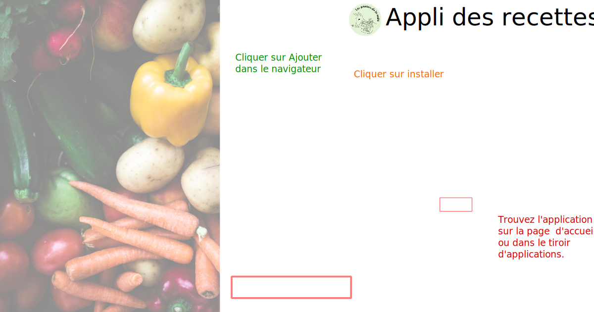

# La Mule Recettes

Recipe app built using Nuxt that fetches the panier of the current week and matching recipes from the server. 




## Backend

The backend can be installed from [RecipeAppBackend](https://github.com/duerrsimon/RecipeAppBackend)

## Build Setup

```bash
# install dependencies
$ yarn install

# serve with hot reload at localhost:3000
$ yarn dev

# generate static project
$ yarn generate
```
## License 

MIT License